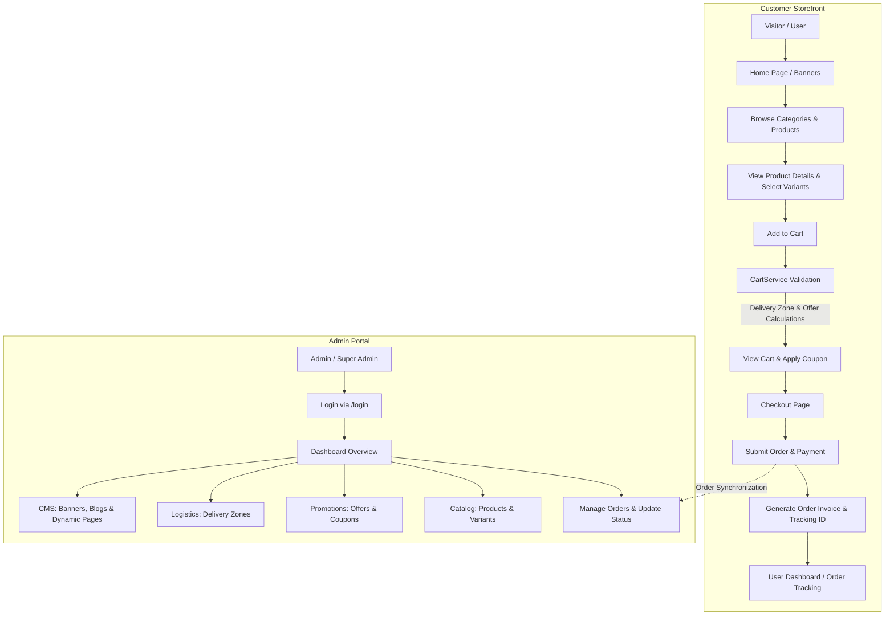

# Food Junction - Laravel E-Commerce & Food Ordering Platform

[](https://laravel.com)
[](https://php.net)
[](https://tailwindcss.com)
[](https://vitejs.dev)
[](LICENSE)

Food Junction is an enterprise-grade online food ordering and e-commerce platform built with **Laravel 11**, **Tailwind CSS**, and **Vite**. The system supports multi-variant product cataloging, advanced promotional offers (BOGO, cart thresholds, category-specific discounts), delivery zone validation, coupon management, blog/media CMS, Stripe payments, and multi-tier administrative controls (Admin and Super Admin).

---

## Table of Contents

1. [Project Overview](#project-overview)
2. [Key Features](#key-features)
3. [Technology Stack](#technology-stack)
4. [System Architecture & File Structure](#system-architecture--file-structure)
5. [Application Business Flow](#application-business-flow)
6. [Prerequisites](#prerequisites)
7. [Installation & Setup Guide](#installation--setup-guide)
8. [Project Run Commands](#project-run-commands)
9. [Utility & Maintenance Commands](#utility--maintenance-commands)

---

## Project Overview

**Food Junction** simplifies online food ordering and inventory administration by separating responsibilities into distinct modules:
- **Frontend Storefront**: Responsive interface for customer food discovery, product variant selection, cart management, checkout with coupons and delivery zone verification, wishlist tracking, and interactive customer reviews.
- **Backend Admin Portal**: Secure multi-tier management hub for store administrators to handle orders, products, product variants, promotional offers, coupon generation, delivery zone boundaries, CMS content (banners, videos, blogs), and user management.
- **Business Logic Layer**: Centralized via `CartService` and custom helpers (`app/Helpers/Helper.php`), ensuring complex calculations (pricing variants, delivery rules, offer rewards) remain consistent across guest sessions and authenticated users.

---

## Key Features

### Storefront & Customer Experience
- **Dynamic Catalog & Search**: Categorized food items, variant options (e.g., portion sizes, flavors), full-text search, and detailed product pages.
- **Advanced Cart Engine (`CartService`)**:
  - Supports guest session-based carts and authenticated user carts.
  - Variant-aware price calculations.
  - Delivery zone compatibility checking per cart item.
- **Promotions & Offers**: Automatic application of active promotional offers based on conditions (item thresholds, cart value, rewards).
- **Checkout & Order Tracking**: Coupon validation (`/coupon-check`), delivery zone selection, unique order tracking ID generation, and order detail lookup.
- **User Dashboard & Wishlist**: Profile updates, password management, order history tracking, and wishlist bookmarking.
- **Community & Content**: Blog posts with comment moderation, embedded video showcases, FAQ section, contact forms, and custom dynamic pages.

### Administrative Management
- **Role-Based Access Control (RBAC)**: Middleware-protected routes for `Admin` (`/admin`) and `Super Admin` (`/super-admin`).
- **Product & Inventory Management**: CRUD operations for categories, products, product variants, and review moderation.
- **Order Processing & Invoicing**: Order status lifecycle updates (Pending, Processing, Completed, Cancelled), line-item review, and printable invoices.
- **Offer & Campaign Engine**: Configure offers with customizable conditions (min quantity/subtotal) and rewards (discount rate, free items).
- **Delivery Zone Logistics**: Define delivery zones and assign specific products to applicable geographic zones.
- **CMS & Script Management**: Home banners, bottom promotional banners, video links, blog posts, FAQs, static pages, and custom script injections (e.g., Google Analytics).

---

## Technology Stack

| Layer | Technologies / Packages |
|---|---|
| **Framework & Language** | PHP 8.2+, Laravel 11.x |
| **Authentication** | Laravel Breeze, Sanctum, Socialite |
| **Database & ORM** | MySQL / PostgreSQL / SQLite, Eloquent ORM |
| **Frontend Utilities** | Blade Templates, Alpine.js, Tailwind CSS, PostCSS, Vite |
| **Data Tables & Exports** | Yajra DataTables (Oracle, HTML, Buttons, Export), PhpSpreadsheet |
| **Payments & Services** | Stripe PHP SDK, Endroid QR-Code, Guzzle HTTP |
| **Testing & Tooling** | Pest PHP, Mockery, Laravel Pint, Laravel Sail, Laravel Brain |

---

## System Architecture & File Structure

```text
Food_Junction/
├── app/
│   ├── Helpers/
│   │   ├── Helper.php              # Shared helper class (file upload, slug generation, standard JSON response)
│   │   └── functions.php           # Global utility functions
│   ├── Http/
│   │   ├── Controllers/
│   │   │   └── Web/
│   │   │       ├── Auth/           # Breeze authentication controllers (Login, Register, Password Reset)
│   │   │       ├── Backend/        # Admin panel controllers (Product, Order, Category, Offer, Coupon, CMS, Settings)
│   │   │       └── Frontend/       # Customer-facing controllers (Home, Cart, Order, Wishlist, Contact, Search)
│   │   ├── Middleware/
│   │   │   ├── AdminMiddleware.php       # Guards /admin routes
│   │   │   ├── SuperAdminMiddleware.php  # Guards /super-admin routes
│   │   │   ├── NoCache.php              # Disables response caching for sensitive routes
│   │   │   └── DebugLoginRequest.php    # Debug middleware
│   ├── Models/                     # 29 Eloquent ORM Models (User, Product, ProductVariant, Cart, Order, Offer, etc.)
│   ├── Services/
│   │   └── CartService.php         # Core service encapsulating cart storage, price calculation & offer rewards
│   ├── Mail/                       # Mailables for system notifications
│   └── Providers/                  # Application service providers
├── bootstrap/
│   └── app.php                     # Laravel 11 routing, middleware aliases, and custom exception handling
├── config/                         # App, database, auth, stripe, and service configs
├── database/
│   ├── factories/                  # Model factories for testing
│   ├── migrations/                 # 35 database migration files
│   └── seeders/                    # Database seeders (DatabaseSeeder, UserSeeder, etc.)
├── public/                         # Web root (index.php, compiled assets, uploaded files)
├── resources/
│   ├── css/                        # Custom CSS & Tailwind styles
│   ├── js/                         # JavaScript entries & Alpine initialization
│   └── views/
│       ├── auth/                   # Breeze authentication views
│       ├── backend/                # Admin portal views (Dashboard, Products, Orders, Offers, CMS)
│       └── frontend/               # Storefront views (Home, Product Detail, Cart, Checkout, User Dashboard)
├── routes/
│   ├── web.php                     # Frontend store routes & utility cache clear endpoints
│   ├── backend.php                 # Admin routes (/admin prefix guarded by Admin middleware)
│   ├── settings.php                # Admin settings routes (/admin/settings prefix)
│   ├── superAdmin.php              # Super Admin routes (/super-admin prefix)
│   ├── auth.php                    # Breeze authentication routes
│   └── console.php                 # Artisan console commands
├── storage/                        # Logs, framework cache, and compiled views
├── tests/                          # Pest PHP feature & unit tests
├── composer.json                   # PHP dependencies
├── package.json                    # Node dependencies & Vite build scripts
├── tailwind.config.js              # Tailwind CSS configuration
└── vite.config.js                  # Vite bundler configuration
```

---

## Application Business Flow



---

## Prerequisites

Ensure your system meets the following requirements before setting up the application:

- **PHP**: `^8.2` (Extensions: `PDO`, `Mbstring`, `OpenSSL`, `BCMath`, `Ctype`, `Fileinfo`, `JSON`, `Tokenizer`, `XML`, `GD` or `Imagick`, `Zip`)
- **Composer**: `^2.0`
- **Node.js**: `^18.0` or higher
- **NPM**: `^9.0` or higher
- **Database**: MySQL 8.0+, PostgreSQL, or SQLite

---

## Installation & Setup Guide

Follow these steps to set up the project locally:

### 1. Clone the Repository
```bash
git clone <repository-url>
cd Food_Junction
```

### 2. Install PHP Dependencies
```bash
composer install
```

### 3. Install Node Dependencies
```bash
npm install
```

### 4. Configure Environment Variables
Copy the `.env.example` file to create `.env`:
```bash
cp .env.example .env
```
*(On Windows Command Prompt, use: `copy .env.example .env`)*

### 5. Generate Application Key
```bash
php artisan key:generate
```

### 6. Configure Database Settings
Update the database connection parameters in your `.env` file:
```env
DB_CONNECTION=mysql
DB_HOST=127.0.0.1
DB_PORT=3306
DB_DATABASE=food_junction
DB_USERNAME=root
DB_PASSWORD=
```

### 7. Run Database Migrations & Seeders
Execute the database migrations to set up all 35 database tables and seed initial data:
```bash
php artisan migrate --seed
```

### 8. Create Storage Symlink
Link the public storage directory to enable uploaded image previews:
```bash
php artisan storage:link
```

---

## Project Run Commands

To launch the project locally, run both the backend server and the frontend asset compiler.

### Standard Development Server (Laravel Artisan)

#### Step 1: Start Laravel Backend Server
```bash
php artisan serve
```
> The application will be accessible at: **`http://127.0.0.1:8000`**

#### Step 2: Start Vite Frontend Hot-Reload Compiler
In a separate terminal window, run:
```bash
npm run dev
```

---

### Alternative Environment Options

#### Running with Laravel Herd / Valet
If you are using Laravel Herd or Valet on Windows/Mac, point your site domain to the project root directory. Simply run:
```bash
npm run dev
```
And access your app via Herd URL (e.g., `http://food-junction.test`).

#### Running with Docker (Laravel Sail)
If you prefer running inside isolated Docker containers using Sail:
```bash
# Start Docker containers
./vendor/bin/sail up -d

# Run migrations inside container
./vendor/bin/sail artisan migrate --seed

# Run asset dev server
./vendor/bin/sail npm run dev
```

---

## Production Build & Bundling

When preparing to deploy to a production environment:

```bash
# Compile and minify frontend assets
npm run build

# Optimize Laravel route and config caching
php artisan config:cache
php artisan route:cache
php artisan view:cache
```

---

## Utility & Maintenance Commands

### Clear All Caches
To reset configuration, route, view, and application cache via CLI:
```bash
php artisan config:clear
php artisan cache:clear
php artisan route:clear
php artisan view:clear
php artisan optimize:clear
```
> *Alternatively, navigate to `http://127.0.0.1:8000/dev/clear-all` in your browser during local development to trigger cache clearing.*

### Refresh Database & Re-seed
To drop all tables, re-execute migrations, and populate fresh seed data:
```bash
php artisan migrate:fresh --seed
```

### Code Formatting (Laravel Pint)
To format PHP files according to standard code guidelines:
```bash
./vendor/bin/pint
```

### Run Test Suite (Pest PHP)
To execute automated unit and integration tests:
```bash
./vendor/bin/pest
```
or via Artisan:
```bash
php artisan test
```
